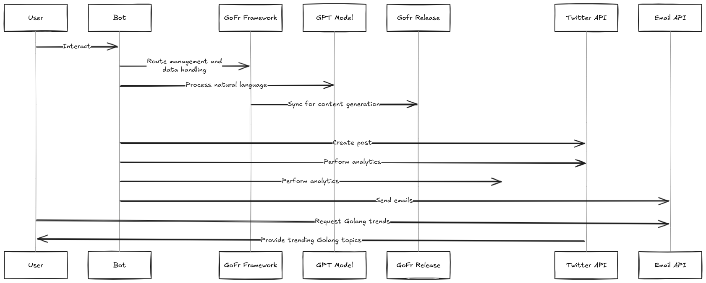
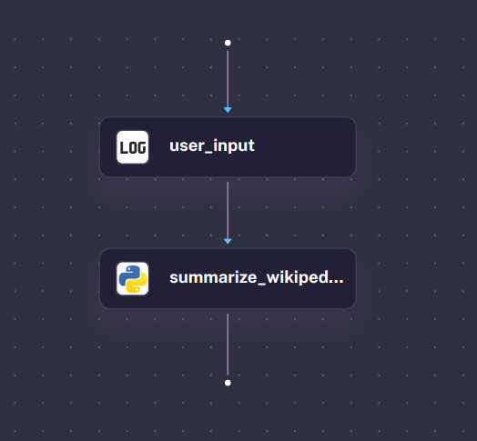
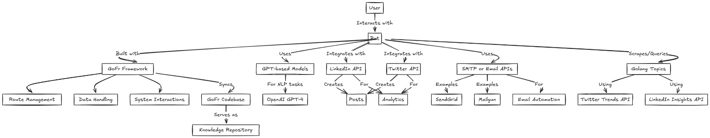

# Social Media Outreach and Wikisearch AI

Social Media Outreach and Wikisearch AI Workflow leverages Kestra's powerful workflow pipeline to automate and optimize social media outreach and wiki-based search tasks. Using AI, it streamlines the process of gathering, analysing, and sharing content across social media platforms while efficiently retrieving relevant information from wikis, enhancing engagement and content discovery.


## Pipeline Structure

#### social-media-workflow


#### wikisearch_with_genai


## Technologies Used

- **Golang Framework**: Route management and data handling
- **GPT Model (e.g., GPT-4)**: Content generation and analysis
- **Kestra Workflow Engine**: Pipeline the deployment

## Setup

### Prerequisites

- Go (1.18+)
- Docker (for Kestra Engine)
- Ollama (for LLM model serving)
- API keys for Twitter and Mailgun
- Kestra Engine server running

### Running Locally

1. **Run Kestra Engine**:
   Use Docker to run Kestra Engine on port 8080:
   ```bash
   docker run --pull=always --rm -it -p 8080:8080 --user=root -v /var/run/docker.sock:/var/run/docker.sock -v /tmp:/tmp kestra/kestra:latest server local
   ```

2. **Run Ollama**:
    `curl -fsSL https://ollama.com/install.sh | sh`
    `ollama serve`
3. Run Kestra Workflow: Ensure that the necessary environment variables are set in .env (API keys and secrets), then run the bot server:
The Kestra Workflow server will run on port 8080.




## Contribution
Contributions are welcome! If you'd like to contribute, please fork the repository and submit a pull request. For bug reports or feature requests, please open an issue.

