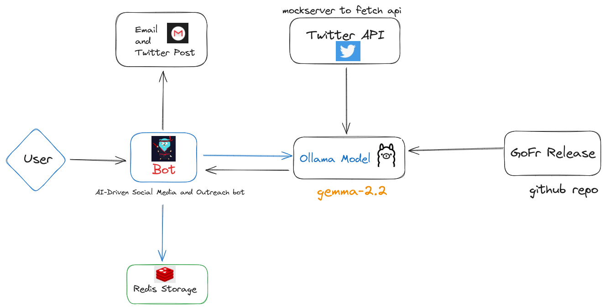

# Social Media Outreach and Wikisearch AI

Social Media Outreach and Wikisearch AI Workflow is an AI-driven bot that integrates with Golang framework to automate social media and email outreach tasks. It uses AI to generate content, monitors trending topics in Golang, and sends posts to Twitter and emails to target recipients. The bot is built using Golang, GPT models, and various APIs for social media and email handling.




## Pipeline Structure


## Technologies Used

- **Golang Framework**: Route management and data handling
- **GPT Model (e.g., GPT-4)**: Content generation and analysis
- **Kestra Workflow Engine**: Pipeline the deployment

## Setup

### Prerequisites

- Go (1.18+)
- Docker (for Redis)
- Ollama (for LLM model serving)
- API keys for Twitter and Mailgun
- Redis server running

### Running Locally

1. **Run Redis**:
   Use Docker to run Redis on port 2002:
   ```bash
   docker run --name gofr-redis -p 2002:6379 -d redis

2. **Run Ollama**:
    `curl -fsSL https://ollama.com/install.sh | sh`
    `ollama serve`
3. Run Kestra Workflow: Ensure that the necessary environment variables are set in .env (API keys and secrets), then run the bot server:
The Kestra Workflow server will run on port 8080.


## Contribution
Contributions are welcome! If you'd like to contribute, please fork the repository and submit a pull request. For bug reports or feature requests, please open an issue.

